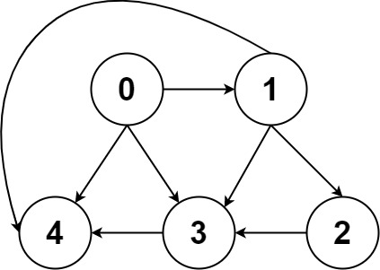
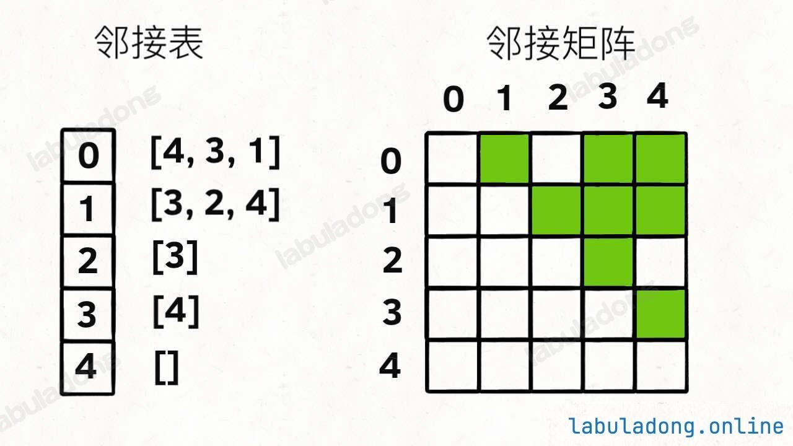

# 图常见概念
    1. 图结构逻辑上由若干节点（Vertex）和边（Edge）构成
    2. 一般用邻接表、邻接矩阵等方式来存储图

## 举例
```java
/**
 * 邻接表
 * graph[x] 存储 x 的所有邻居节点
 */
List<Integer>[] graph;

/**
 *  邻接矩阵
 *  matrix[x][y] 记录 x 是否有一条指向 y 的边
 */
boolean[][] matrix;
```

