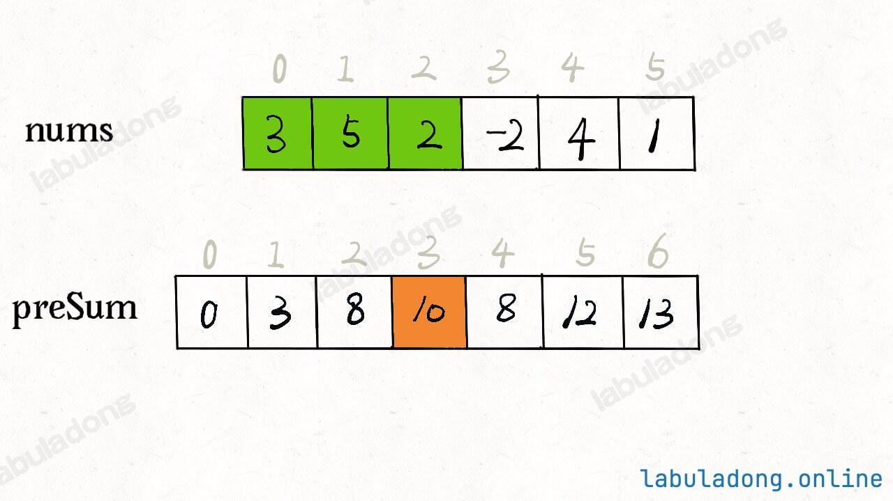
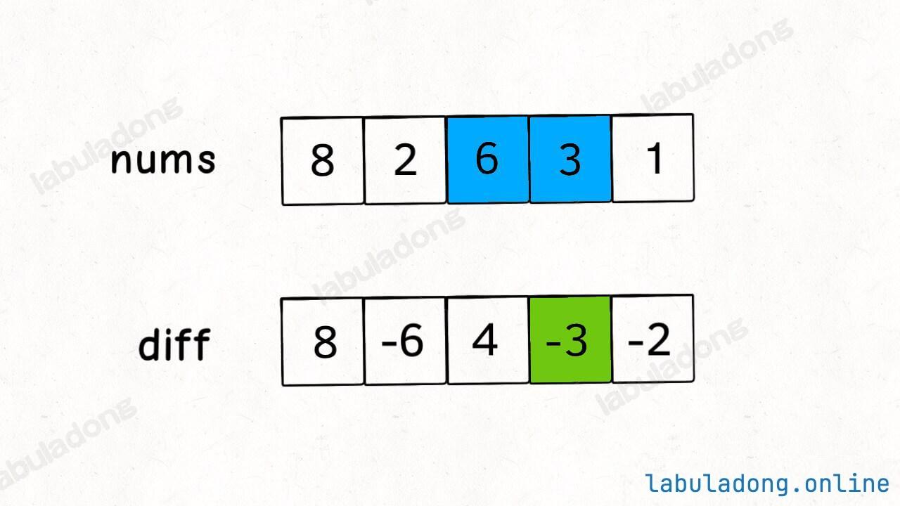

# 小而美的数组框架
## 前缀和数组
    解决：快速、频繁地计算一个索引区间内的元素之和（积）
    不能解决：nums[]元素会变化、不存在逆运算(x+6=10 x=10-6就是逆运算)场景

---

一维数组框架

```java
class NumArray {
    // 前缀和数组
    private int[] preSum;

    // 输入一个数组，构造前缀和
    public NumArray(int[] nums) {
        // preSum[0] = 0，便于计算累加和
        preSum = new int[nums.length + 1];
        // 计算 nums 的累加和
        for (int i = 1; i < preSum.length; i++) {
            preSum[i] = preSum[i - 1] + nums[i - 1];
        }
    }

    // 查询闭区间 [left, right] 的累加和,注意left 和 right原数组的下标。
    public int sumRange(int left, int right) {
        return preSum[right + 1] - preSum[left];
    }
}
```
二维数组框架
```java
// preSum[i-1][j-1] = A
//      ↓
// +-----------+------+
// |           |      |
// |   A       |  B   |   ← preSum[i-1][j] = A + B
// |           |      |
// +-----------+------+
// |     C     |  D   |   ← D 是 matrix[i-1][j-1]
// +-----------+------+
//     ↑
// preSum[i][j-1] = A + C
// (preSum[i-1][j] + preSum[i][j-1]  - preSum[i-1][j-1]) + matrix[i-1][j-1]
// (A + B + A + C - A) + D = A + B + C + D
class NumMatrix {
    // preSum[i][j] 记录矩阵 [0, 0, i-1, j-1] 的元素和
    private int[][] preSum;

    public NumMatrix(int[][] matrix) {
        int m = matrix.length, n = matrix[0].length;
        if (m == 0 || n == 0) return;
        // 构造前缀和矩阵
        preSum = new int[m + 1][n + 1];
        for (int i = 1; i <= m; i++) {
            for (int j = 1; j <= n; j++) {
                // 和一维数组类似，preSum[i] + nums[i-1] 只不过，preSum[i]变成了三个矩阵计算得出。
                preSum[i][j] = (preSum[i-1][j] + preSum[i][j-1] - preSum[i-1][j-1]) + matrix[i - 1][j - 1] ;
            }
        }
    }

    // 计算子矩阵 [x1, y1, x2, y2] 的元素和
    public int sumRegion(int x1, int y1, int x2, int y2) {
        // 和一维数组类似，preSum[j+1] - preSum[i] 只不过，后面preSum变成了三个矩阵计算得出。
        return preSum[x2+1][y2+1] - (preSum[x1][y2+1] + preSum[x2+1][y1] - preSum[x1][y1]);
    }
}
```

---
例题

[303. 区域和检索 - 数组不可变](https://leetcode.cn/problems/range-sum-query-immutable/description/) 标准一维数组前缀和

[304. 二维区域和检索 - 矩阵不可变](https://leetcode.cn/problems/range-sum-query-2d-immutable/description/) 标准二维数组前缀和

高频习题

[1314. 矩阵区域和](https://leetcode.cn/problems/matrix-block-sum/description/) 套用二维数组前缀和，注意边界。

[724. 寻找数组的中心下标](https://leetcode.cn/problems/find-pivot-index/description/)


- [ ] [238. 除自身以外数组的乘积](https://leetcode.cn/problems/product-of-array-except-self/description/)

- [ ] [1352. 最后 K 个数的乘积](https://leetcode.cn/problems/product-of-the-last-k-numbers/description/)

-[ ] [525. 连续数组](https://leetcode.cn/problems/contiguous-array/description/)

-[ ] [523. 连续的子数组和](https://leetcode.cn/problems/continuous-subarray-sum/description/)

[560. 和为 K 的子数组](https://leetcode.cn/problems/subarray-sum-equals-k/description/)

- [ ] [974. 和可被 K 整除的子数组](https://leetcode.cn/problems/subarray-sums-divisible-by-k/description/)

- [ ] [1124. 表现良好的最长时间段](https://leetcode.cn/problems/longest-well-performing-interval/description/)

---

## 差分数组
    适用于：频繁对原始数组的某个区间的元素进行增减
---
    技巧：如果要的一段区间[i,j]里面加一个值假设3
    只需要diff[i] += 3 代表nums[i,...] 全都加3
    diff[j+1] -= 3 代表nums[j+1,...] 全都减3
    那么二者综合，则达成目标。

---

```java
// 差分数组工具类
class Difference {
    // 差分数组
    private int[] diff;

    // 输入一个初始数组，区间操作将在这个数组上进行
    public Difference(int[] nums) {
        assert nums.length > 0;
        diff = new int[nums.length];
        // 根据初始数组构造差分数组
        diff[0] = nums[0];
        for (int i = 1; i < nums.length; i++) {
            diff[i] = nums[i] - nums[i - 1];
        }
    }

    // 给闭区间 [i, j] 增加 val（可以是负数）
    public void increment(int i, int j, int val) {
        diff[i] += val;
        if (j + 1 < diff.length) {
            diff[j + 1] -= val;
        }
    }

    // 返回结果数组
    public int[] result() {
        int[] res = new int[diff.length];
        // 根据差分数组构造结果数组
        res[0] = diff[0];
        for (int i = 1; i < diff.length; i++) {
            res[i] = res[i - 1] + diff[i];
        }
        return res;
    }
}
```