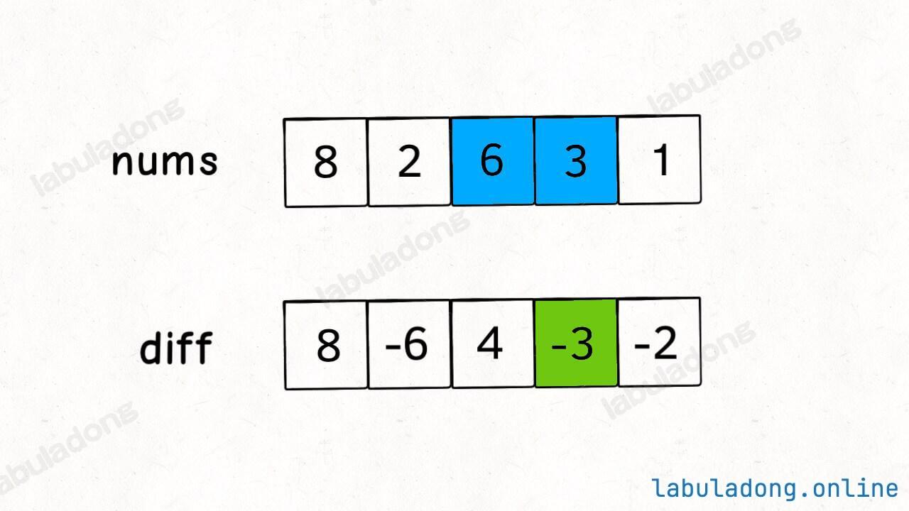

## 差分数组
    适用于：频繁对原始数组的某个区间的元素进行增减
    原理：对差分数组diff[i]操作，则相当于对原数组从i到末尾的所有值进行操作
---
    技巧：如果要的一段区间[i,j]里面加一个值假设3
    只需要diff[i] += 3 代表nums[i,...] 全都加3
    diff[j+1] -= 3 代表nums[j+1,...] 全都减3
    那么二者综合，则达成目标。

---

```java
// 差分数组工具类
class Difference {
    // 差分数组
    private int[] diff;

    // 输入一个初始数组，区间操作将在这个数组上进行
    public Difference(int[] nums) {
        assert nums.length > 0;
        diff = new int[nums.length];
        // 根据初始数组构造差分数组，这里和前缀和不一样的点是，
        // 计算表达式里面不需要用到diff，前置和计算表达式要用到preSum
        diff[0] = nums[0];
        for (int i = 1; i < nums.length; i++) {
            diff[i] = nums[i] - nums[i - 1];
        }
    }

    // 给闭区间 [i, j] 增加 val（可以是负数）
    public void increment(int i, int j, int val) {
        diff[i] += val;
        if (j + 1 < diff.length) {
            diff[j + 1] -= val;
        }
    }

    // 返回结果数组
    public int[] result() {
        int[] res = new int[diff.length];
        // 根据差分数组构造结果数组
        res[0] = diff[0];
        for (int i = 1; i < diff.length; i++) {
            res[i] = res[i - 1] + diff[i];
        }
        return res;
    }
}
```

---
例题：

[1109. 航班预订统计](https://leetcode.cn/problems/corporate-flight-bookings/description/) 标准差分数组题，频繁对原数组区间加数

[1094. 拼车](https://leetcode.cn/problems/car-pooling/description/) 标准差分数组题，频繁对原数组区间加数，最后求数组某个值是否大于n